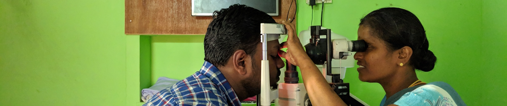

# Detecting-Diabetic-Retinopathy
## **Problem Statement**

Diabetic Retinopathy (DR) is one of the causes of vision loss among individuals with diabetes. Manual screening processes are time-consuming, resource-intensive, and often unavailable in underserved or rural areas. There is a need for a scalable, efficient, and reliable solution to detect DR early and accurately .

This is how eyes are examined and need to check fundus of eye manually and make decision. This is time consuming and also we need experts to perform and instrument to check. 

## **Expected Outcomes**

- AI model that can identify signs of Diabetic Retinopathy from retinal scans.
- Reduced dependency on specialist availability through assistive diagnostics.
- Deployment potential in remote areas through mobile or edge devices.
- A step towards large-scale screening for DR, contributing to early intervention and treatment.

## Dataset idea

From background knowledge of DR, I believe we would need data

## Class details

0 - No DR

1 - Mild

2 - Moderate

3 - Severe

4 - Proliferative DR

This is how problem becomes of multi class classification.
