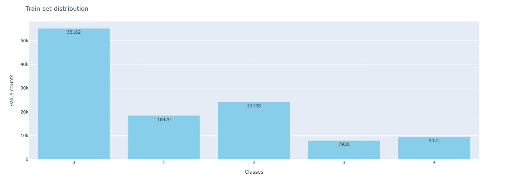

Take a look at 100 images of each class.
### class 0

### class 1

### class 2

### class 3

### class 4

### Train set distribution  (Total images = 1,15,241, 80% of entire data)
Class 0: 47.86% 

Class 1: 16.02% 

Class 2: 20.99% 

Class 3: 6.88% 

Class 4: 8.22% 

### Val set distribution (Total images = 14,227, 10% of entire data)
Class 0: 48.46% 

Class 1: 12.93% 

Class 2: 21.25% 

Class 3: 7.02% 

Class 4: 10.31% 

### Test set distribution (Total images = 14,201, 10% of entire data)
Class 0: 47.86% 

Class 1: 16.02% 

Class 2: 20.99% 

Class 3: 6.88% 

Class 4: 8.22% 

